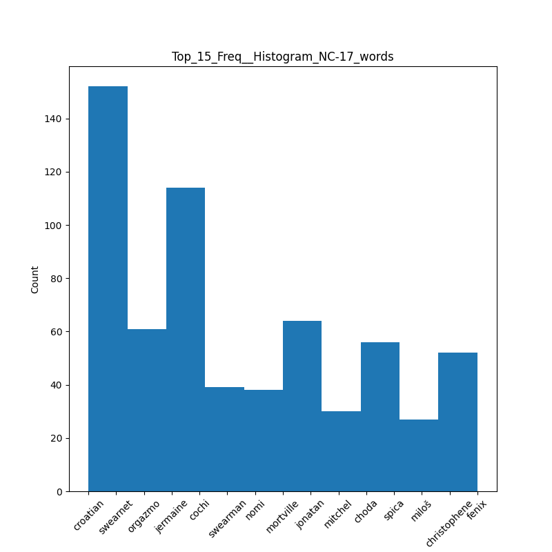

---
author:
- Baktash Ansari
date: 2023-06-06
title: Project Phase 1
---

# Introduction

In this report, I intend to present the stages of data extraction and
analysis, along with the reports obtained from the code.

## Tasks performed 

-   Data crawling in multiple stages:

    -   Crawling the labels

    -   Crawling the IMDb ID of each movie

    -   Crawling the subtitles of each movie

-   Data cleaning:

    -   Actions taken for data cleaning

    -   Location of the cleaned data storage

-   Data segmentation and dataframe creation:

    -   Segmentation into sentences and words

    -   Creation of a dataframe for uploading to Hugging Face

-   Preparation of reports:

    -   Reports in the form of tables and charts

-   Final remarks and challenges

# Instructions for Executing Project

Before starting the work, I need to inform you about the commands you
need to enter to execute each section of the first phase of the project.
The required commands are in the format of a bash script.

## Crawling Data 

To crawl the data as described in the following sections, you need to
execute the `CrawlData.sh` file in the project directory using the
following command:

    sh CrawlData.sh

After executing it, you will be prompted with questions regarding data
extraction, and the necessary data will be extracted upon completion.

## Data Cleaning and Data Frames 

For data cleaning and creating data frames, you need to run the
`CleanData.sh` file. To execute it, use the following command:

    sh CleanData.sh

## Generating Reports 

Lastly, to generate graphs and tables, you should run the `Reports.sh`
file. Use the following command to execute it:

    sh Reports.sh

Please ensure that the `latex` folder exists in the project directory.
After running the final command, you will be able to view the generated
PDF within this folder.

Note that you should execute all of these commands sequentially and not
change the order.

# Crawling Data

To crawl the data, I first provide an explanation about the data
structure used. Since I intend to separate the subtitles based on age
rating, I need to collect a set of movies to be able to separate the age
rating of each movie and its corresponding subtitle. For this purpose, I
use a unique value for each movie that the IMDb website has assigned,
called the IMDb ID. This value is a unique key that distinguishes each
movie from another, and we need it to extract information about each
movie. To crawl a large collection of IMDb IDs, I used the Beautiful
Soup library, which allowed me to parse the HTML of the IMDb website and
obtain approximately 5,000 to 10,000 IDs.

Next, after crawling these IDs, using them and the cinemagoer library in
Python, which is an IMDb-dependent library, I was able to extract the
certificates of each movie. A certificate is essentially a list of movie
age ratings in different countries, according to the different laws of
those countries. I used the United States as the country of reference.

In the second part, by taking the number of subtitles from the user for
data crawling and IMDb IDs, I crawled a collection of each IMDb ID and
its corresponding age rating, and stored these values in a text file
named \"labels.txt.\"

In the third step, it is necessary to download the subtitles for each
movie based on the IMDb ID. For this task, I used the library and API
associated with the Open Subtitles website. An important note about
downloading subtitles with each account is that only 300 subtitles can
be crawled per day with a single account. By creating two \"Maximus\"
accounts, I can download up to 600 subtitles within 24 hours.

Finally, I downloaded the subtitles and stored them in the
\"subtitle/eng\" folder.

# Structure of crawled data

The structure of crawled data is as follows:

-   A folder named \"subtitle\" where the subtitles are stored (the name
    of each subtitle is equal to its corresponding IMDb ID).

-   A file named \"labels.txt\" where the IDs and their corresponding
    labels are stored.

-   A file where the IDs of the movies for which subtitles have been
    downloaded are placed.

# Cleaning Data

I have performed the following steps to clean the data:

-   Since subtitle files are in the SRT format and have a specific
    structure where each sentence is displayed with a time stamp and
    sequence number, I need to remove these values and keep only the
    subtitle text. To accomplish this, I use the `re` library and remove
    these values using regex.

-   Subtitles often output one sentence at a time, so I use sentence
    breaking to separate the sentences. I utilize the existing sentence
    structure provided by the subtitles themselves.

-   Punctuation marks are then removed using the NLTK library.

-   I attempted another method for sentence tokenization using the
    `sent_tokenize` NLTK function, but the results were not
    satisfactory. Therefore, I preferred to rely on the sentence
    structure provided by the subtitles.

-   For word tokenization, I used the `word_tokenize` function from the
    NLTK library.

# Structure of cleaned data

The structure of the cleaned data is as follows: all the data is stored
within the \"clean\" directory. Each subtitle is cleaned from the
\"raw\" folder and saved in the \"clean\" folder as a TXT file with its
corresponding ID as the filename.

Then, I bring the cleaned data into pandas data frames, where each data
frame consists of a list of sentences from each subtitle, along with
their respective labels. These data frames are saved in the
\"sentencebroken\" folder. Additionally, a separate data frame is
created for each subtitle, containing a list of words along with their
corresponding labels. These data frames are saved in the \"wordbroken\"
folder. Finally, these data frames are saved as CSV files. These CSV
files uploaded to Hugging Face for further processing.

# Hugging Face

You can access two data frames, namely \"sentence broken\" and \"word
broken,\" at the following link:\
[Hugging Face
Dataset](https://huggingface.co/datasets/Baktashans/Subttitles_AgeRate_Data)

# Reports

The following reports are presented in the form of tables and charts,
providing information about the data.

## General Report 

For each label we have :

-   Number of subtitles ( data )

-   Numebr of sentences

-   Number of words

-   Number of unique words (non-duplicate words)

## Number of unique words that are common and non-common in every two labels 

## 10 non-common words of each label 

## The top 10 common words for each label compared to other labels based on the relative normalized frequency criterion. 

## Top 10 Words for each label based of TF-IDF 

## Top 15 Words for each label histogram ( from high to low freq ) 

