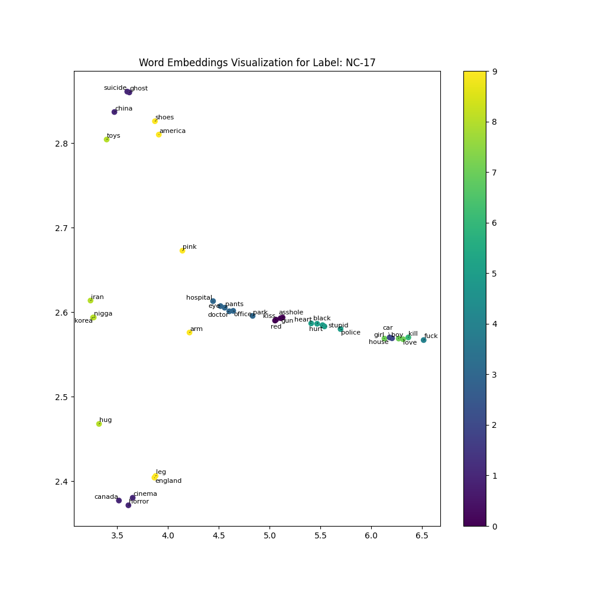
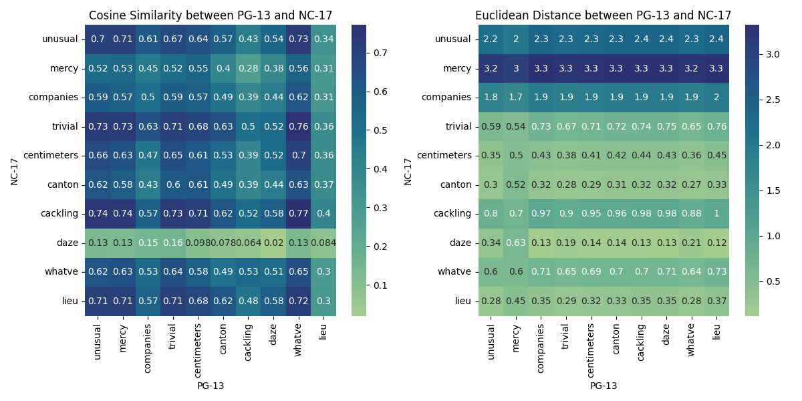

---
author:
- Baktash Ansari
date: 2023-06-06
title: Age-rating classification for movie subtitles
---

# Age-rating movies Classification based-on subtitle

**Date:** 20.04.2023

## Project Proposal

### Overview
With the increasing demand for media content and films, and the rise of film platforms and discussions about films on social networks, access to films and series has become much easier and more accessible for children, individuals under the legal age, and those who have problems watching inappropriate content. This also means that families and acquaintances of these individuals may want to evaluate the level of inappropriate or undesirable scenes in these films before watching them, and this can be done with subtitles and the textual content of the films.

The goal of this project is to implement a language model that allows families and content producers to identify the age-rating of a film based on its subtitles. The applications of this language model are not only for film classification but also for comparing multiple subtitles and finding a suitable subtitle with less sensitive content for the film.

Additionally, the collected subtitles for films in different age groups can be analyzed before training the language model, and various features can be obtained for each age-rating.

### Goals
1. Analyzing collected subtitles for films in different age groups and obtaining various features for each age rating.
2. Facilitating the comparison of multiple subtitles and the selection of subtitles with less sensitive content for films.
3. Build a language model that can accurately classify input subtitles based on age rating labels.

### Milestones

#### Data Collection:
Since our data is subtitles of films, it is in spoken form. The two main languages for the data are Persian and English, which are the languages of the film subtitles. However, if possible, I will use multilingual language models to see the results of the model on multiple languages. Since English subtitles for films are more standardized and I can indicate the emphasis of the text with lowercase and uppercase letters, as well as question and exclamation marks, this language is my first priority.

The data is divided into several categories based on the age restrictions of the films on IMDB, which are as follows:
- G - General Audiences: Suitable for all ages, including children.
- PG - Parental Guidance Suggested: Some material may not be suitable for children. Parents are urged to give "parental guidance." May contain some mild language, some sexual content, and some violent situations/action.
- PG-13 - Parents Strongly Cautioned: Some material may be inappropriate for children under 13. Parents are urged to be cautious. May contain some profanity, some sexual content, and/or some intense violence.
- R - Restricted: Not suitable for children under 17. Contains adult themes, adult activity, hard language, intense or persistent violence, sexually-oriented nudity, drug abuse, or other elements.
- NC-17 - No One 17 and Under Admitted: Clearly adult. Children are not admitted. Contains explicit adult content.

We can use the following websites to collect data:
- Opensubtitle: This site contains a large collection of film subtitles in various languages, which probably also provides an API for us.
- IMDB: We can use the IMDB website for the age-rating of films. We can also use other websites that provide subtitles.

#### Data Preprocessing:
Since the collected data is in files with the srt format, we first need to extract all the text from the files. Then we will preprocess the data by removing noise and irrelevant information, such as stop words and punctuation. We will also tokenize the text and remove any special characters.

#### Feature Extraction:
We can extract some features from preprocess text, including word frequency, n-grams, and semantic and syntactic analysis. Based on some sensitive and offensive data and words and syntactic label of each sentence, we can classify the text.

#### Train model:
We can use pre-trained transformer models such as BERT, RoBERTa, or DistilBERT, and fine-tune them on our subtitle dataset. These models can be fine-tuned for classification tasks such as age rating classification. The picture below from [this article](https://ojs.aaai.org/index.php/AAAI/article/view/3844/3722) might be helpful.

#### Evaluation:
We will train and evaluate the performance of the model using appropriate metrics, such as accuracy, precision, recall, and F1-score.

### Expected Outcomes:
It is expected that ultimately the trained model will be able to display an appropriate age range label in the output using an input subtitle.

### Challenges:
One important point about this task is that the age restrictions imposed on movies are not only based on their dialogues but also involve visual content, which creates a challenge. Another challenge that may arise is the large amount of input data, as each subtitle contains a lot of content. Classifying such inputs into only five types of labels may be challenging.

### Articles:
Two articles that were almost close to this idea, and I found reviewing them useful:
1. [Article 1](https://ojs.aaai.org/index.php/AAAI/article/view/3844/3722)
2. [Article 2](https://aclanthology.org/Y18-1007.pdf)

# Phase 1 

## Introduction

In this report, I intend to present the stages of data extraction and
analysis, along with the reports obtained from the code.

## Tasks performed 

-   Data crawling in multiple stages:

    -   Crawling the labels

    -   Crawling the IMDb ID of each movie

    -   Crawling the subtitles of each movie

-   Data cleaning:

    -   Actions taken for data cleaning

    -   Location of the cleaned data storage

-   Data segmentation and dataframe creation:

    -   Segmentation into sentences and words

    -   Creation of a dataframe for uploading to Hugging Face

-   Preparation of reports:

    -   Reports in the form of tables and charts

-   Final remarks and challenges

# Instructions for Executing Project

Before starting the work, I need to inform you about the commands you
need to enter to execute each section of the first phase of the project.
The required commands are in the format of a bash script.

## Crawling Data 

To crawl the data as described in the following sections, you need to
execute the `CrawlData.sh` file in the project directory using the
following command:

    sh CrawlData.sh

After executing it, you will be prompted with questions regarding data
extraction, and the necessary data will be extracted upon completion.

## Data Cleaning and Data Frames 

For data cleaning and creating data frames, you need to run the
`CleanData.sh` file. To execute it, use the following command:

    sh CleanData.sh

## Generating Reports 

Lastly, to generate graphs and tables, you should run the `Reports.sh`
file. Use the following command to execute it:

    sh Reports.sh

Please ensure that the `latex` folder exists in the project directory.
After running the final command, you will be able to view the generated
PDF within this folder.

Note that you should execute all of these commands sequentially and not
change the order.

# Crawling Data

To crawl the data, I first provide an explanation about the data
structure used. Since I intend to separate the subtitles based on age
rating, I need to collect a set of movies to be able to separate the age
rating of each movie and its corresponding subtitle. For this purpose, I
use a unique value for each movie that the IMDb website has assigned,
called the IMDb ID. This value is a unique key that distinguishes each
movie from another, and we need it to extract information about each
movie. To crawl a large collection of IMDb IDs, I used the Beautiful
Soup library, which allowed me to parse the HTML of the IMDb website and
obtain approximately 5,000 to 10,000 IDs.

Next, after crawling these IDs, using them and the cinemagoer library in
Python, which is an IMDb-dependent library, I was able to extract the
certificates of each movie. A certificate is essentially a list of movie
age ratings in different countries, according to the different laws of
those countries. I used the United States as the country of reference.

In the second part, by taking the number of subtitles from the user for
data crawling and IMDb IDs, I crawled a collection of each IMDb ID and
its corresponding age rating, and stored these values in a text file
named \"labels.txt.\"

In the third step, it is necessary to download the subtitles for each
movie based on the IMDb ID. For this task, I used the library and API
associated with the Open Subtitles website. An important note about
downloading subtitles with each account is that only 300 subtitles can
be crawled per day with a single account. By creating two \"Maximus\"
accounts, I can download up to 600 subtitles within 24 hours.

Finally, I downloaded the subtitles and stored them in the
\"subtitle/eng\" folder.

# Structure of crawled data

The structure of crawled data is as follows:

-   A folder named \"subtitle\" where the subtitles are stored (the name
    of each subtitle is equal to its corresponding IMDb ID).

-   A file named \"labels.txt\" where the IDs and their corresponding
    labels are stored.

-   A file where the IDs of the movies for which subtitles have been
    downloaded are placed.

# Cleaning Data

I have performed the following steps to clean the data:

-   Since subtitle files are in the SRT format and have a specific
    structure where each sentence is displayed with a time stamp and
    sequence number, I need to remove these values and keep only the
    subtitle text. To accomplish this, I use the `re` library and remove
    these values using regex.

-   Subtitles often output one sentence at a time, so I use sentence
    breaking to separate the sentences. I utilize the existing sentence
    structure provided by the subtitles themselves.

-   Punctuation marks are then removed using the NLTK library.

-   I attempted another method for sentence tokenization using the
    `sent_tokenize` NLTK function, but the results were not
    satisfactory. Therefore, I preferred to rely on the sentence
    structure provided by the subtitles.

-   For word tokenization, I used the `word_tokenize` function from the
    NLTK library.

# Structure of cleaned data

The structure of the cleaned data is as follows: all the data is stored
within the \"clean\" directory. Each subtitle is cleaned from the
\"raw\" folder and saved in the \"clean\" folder as a TXT file with its
corresponding ID as the filename.

Then, I bring the cleaned data into pandas data frames, where each data
frame consists of a list of sentences from each subtitle, along with
their respective labels. These data frames are saved in the
\"sentencebroken\" folder. Additionally, a separate data frame is
created for each subtitle, containing a list of words along with their
corresponding labels. These data frames are saved in the \"wordbroken\"
folder. Finally, these data frames are saved as CSV files. These CSV
files uploaded to Hugging Face for further processing.

# Hugging Face

You can access two data frames, namely \"sentence broken\" and \"word
broken,\" at the following link:\
[Hugging Face
Dataset](https://huggingface.co/datasets/Baktashans/Subttitles_AgeRate_Data)

# Reports

The following reports are presented in the form of tables and charts,
providing information about the data.

## General Report 

For each label we have :

-   Number of subtitles ( data )

-   Numebr of sentences

-   Number of words

-   Number of unique words (non-duplicate words)

## Top words of each label based on frequency

### G : 

### PG : 

### R : 

### PG-13 : 

### NC-17 : 

## 10 non-common words of each label 

## The top 10 common words for each label compared to other labels based on the relative normalized frequency criterion. 

## Top 10 Words for each label based of TF-IDF 

## Top 15 Words for each label histogram ( from high to low freq ) 

# Project Phase 2

## Introduction
Before starting the explanations of different sections of Phase Two of the project, I would like to mention a few points:
1. First and foremost, due to the large size of the imported models and the volume of training and testing parameters, most parts of this section (almost all of it) were executed remotely on Google Colab, and the results were saved locally. I tried to save as many parts as possible on my local machine (for example, parameters and loss values were saved), but the model and optimizer themselves were almost impossible to store due to their large size.
2. All sections of the project, from Phase One to Phase Two, have been fully documented with comments and detailed explanations inside the notebook named "CrawDataNLProject" in the project directory on GitHub. You can review all my activities for this project in that notebook.
3. The biggest challenge I faced during Phase Two was the hardware limitation. Specifically, I had a weak hardware setup, as I needed a GPU for the project, and the only GPU available to me was on Google Colab, which was also limited in terms of usage time (I had to switch between multiple accounts to avoid losing time).

Ultimately, these challenges led me to work with a small portion of the dataset. For example, although I had around 300,000 to 600,000 sentences for each label, due to the limitations, I had to use only 10,000 to 15,000 of them.

To begin, I provide an explanation of the tasks I performed for each section, followed by presenting the results for better visibility.

## Word2Vec
In this section, I used the gensim library to build and train my own word2vec model in order to create embeddings for the desired words. I utilized the skip-gram architecture and trained the model for 5 epochs. For the loss function, I used negative log likelihood.

Next, I selected a list of words and performed various analyses on them, which I will discuss in detail later.

### Visualize word embeddings for each label
In this section, I needed to visualize the words in a two-dimensional space. To achieve this, I had to reduce the dimensions using the t-SNE algorithm. After dimensionality reduction of the word vectors, I used the k-means algorithm to cluster the words into different groups, allowing us to observe their categorization.

The words I used in this section are as follows:
'fuck', 'stupid', 'nigga', 'girl', 'boy', 'toys', 'england', 'china', 'america', 'ghost', ...

I visualized these words separately for each label, and you can see the results for each label below.

### Euclidean distance and cosine similarity of 20 common words between each pair of labels
Here, I calculated the distances between each pair of words from the previous words using these two metrics, and I stored them in a table called "Heatmap." I performed this process for each pair of labels. The generated plots can be seen after the description of the heatmap.

#### Heatmap
A heatmap is a graphical representation of data in a matrix format, where different colors are used to indicate the magnitude of values. In the context of cosine similarity, a heatmap provides a visual representation of the similarity between pairs of words based on their word embeddings.

In the heatmap, each cell represents the similarity score between a pair of words. The similarity scores are calculated using the cosine similarity measure, which quantifies the similarity between two vectors by measuring the cosine of the angle between them.

For the word2vec section, I trained the models separately for each label and performed one round of training for all the words together. The created models can be found in the "models" directory and are visible for inspection.

At the end of this section, Cosine similarity to find the top nearest words for the specific word "america" is shown.

## Tokenization
In this section, I used the SentencePiece library for tokenization. In order to determine an appropriate vocabulary size, I selected a set of vocab sizes as follows: 500, 1000, 2000, 4000, 8000, 10000, 12500.

I divided the data for each label into 5 parts, and training was conducted in 5 stages, with each stage consisting of 4 parts, while evaluation was performed on the remaining part. The evaluation process is expressed as the percentage of the "unk" token in the total tokens, which is displayed in tables below.

You can see the results in pdf

As observed, the vocabulary size of 500 has significantly fewer "unk" tokens compared to the other sizes.

## Language model for text generating
For this section, I used the GPT-2 model and utilized the available notebook on Kaggle (link: [Fine-tuning GPT-2 to Generate Netflix Descriptions](https://www.kaggle.com/code/nulldata/fine-tuning-gpt-2-to-generate-netlfix-descriptions)). One of the major challenges I encountered in this section was the lack of suitable hardware and graphics capabilities. This made the task difficult to the extent that I had to downsize the data. I had to reduce the number of sentences for each label to 15,000 sentences. Even this number was quite challenging due to usage limitations and required approximately 1 hour per label.

Additionally, I couldn't save the models due to limitations in Google Drive space, so I had to save only the checkpoints every 5000 steps.

Despite all the difficulties in this section, I managed to generate sentences with a highly limited model, which, as you may guess, did not yield satisfactory results. However, you can still observe logical changes in the sentences within the labels, although the expectations were much higher than these values.

### Generated sentences for label PG

0.  inaas well really see get way
1.  ive thought ever would think
2.   ay
3.  ive seen come live together much since arrival home day
4.  ian hes trying get us good night good night come ill work next
5.  ive put foot right far time last time want talk
6.  ibal yes l
7.  ive ever thought life looked pretty nice enough never
8.  ive got five nights keep away
9.  ichael youve got place mr roster
10.  ike always trying put little pressure
11.  ive never seen much
12.  ive really seen since first two hours
13.  ive found one moment courage keep taking care right right back lets leave tonight sleep
14.  ia heh
15.  ive actually got chance
16.  ies see
17.  ive since seen
18.  ina right right youre one okay
19.  ive taken a great step toward understanding new ways

### Generated sentences for label PG-13
0. inaas well see see another way
3.  yes come mr mama said
4.  ive got trouble
5.  ive put foot right feet today huh
6.  leo tred leonnef oar
7.  ive ever thought
8.  izzies oh wow jingles
9.  iam going kill us
10.  iz coming thats coming
11.  ive run
12.  izzy yeah know cant remember name yet yet go get new one next call youve got come back like youve got
13.  ive done little business right years
14.  ive gone past
15.  ive lost family yet
16.  ik er
17.  ive always want
18.  ids find right thing one one something
19.  icky shit

### Generated sentences for label G

0.  irmas well oh see another way
    1.  ive thought nothing except waiting today one last song oh uh ive done
    2.  ive loved music since
    3.  ive seen come live today today right tell us
    4.  ive picked around
    5.  ive put us right end house last time
    7.  ive ever thought life fun thought nice enough never
    8.  ive got go work late
    9.  ive watched little kids growing ever
    10.  ive always heard isnt mean
    11.  ive grown used much use love
    12.  ive really seen someone around town come out astrunk feet water away
    13.  ive found one back right side
    14.  ive gone crazy hell never seen
    15.  ive never saw yet
    16.  ik er
    17.  ive always seen
    18.  ive had idea youd nice nice try
    19.  icky must feel great pain

### Generated sentences for label NC-17

0.  ina need help oh okay sorry
    1.  ive thought nothing would happen today one way
    2.    sodging
    3.  ive seen come today today today right tell
    4.  ive forgotten
    5.  ive put foot right feet three feet would want
    6.  ivan
    7.  ive ever thought
    8.  ive gotten little mail jean
    9.  ichael say could see
    10.  ive always heard voice
    11.  ive never seen anyone get depressed
    12.  ive going
    13.  ive kept busy well enjoy good night today right right around huh
    14.  ive gone crazy hell around things right
    15.  ive never experienced yet
    16.  ive come away id want leave
    17.  ivan didnt want
    18.  ivan right right youlemnys
    19.  ive wanted watch watch

### Generated sentences for label R

0.  ive taken apart entire world since life
    1.  ive thought ever would move
    2.  ive already come talk
    3.  imeis come mmmm okay right
    4.  ive got money
    5.  ive put body right far house town would want know happened
    6.  ichris stowman dont come get phone back day ill wait
    7.  ive ever thought life life life may be like
    8.  ive gotten little hangover therestha waiting waiter im going go
    9.  ichael wenter
    10.  iev gon na put
    11.  ive never used much use car
    12.  ive slept little time alone know l am always dreaming im sleeping next hour
    13.  ive kept eye well seen lately
    14.  icky
    15.  ive told family yeta theyll never think
    16.  ies one
    17.  ive since seen
    18.  ickie right youre one girl
    19.  icky shit

## Classification model
For the classification section, I used the BERT model available in the Hugging Face library. In this section, I first prepared the available data that I created in Phase One of the project with the corresponding labels. However, I had to use a small portion of the data for this section as well (20,000 records per label).

Then, I divided the data into train and test sets using the sklearn library and started the training process (with a ratio of 85% for training and 15% for testing). I manually conducted the training process, performing 5 epochs with a batch size of 16.

After each epoch, the models were saved in the "models" directory, and the log of each epoch was also stored in the "logs" folder.

For the evaluation section, I used metrics such as F1 score and accuracy per class, which can be seen in tables below.

For this section, I took assistance from the following link: [Multi-Class Text Classification with Deep Learning using BERT](https://towardsdatascience.com/multi-class-text-classification-with-deep-learning-using-bert-b59ca2f5c613).

## Fine-tuning on Chat-GPT API
For this section, I created the desired data in the input format for the API and used the required API key. However, it seems that there are limitations on free APIs that do not allow the fine-tuning process. Nevertheless, the prompts and the related data for it are available in the GPT folder.

## References
For the resources, I utilized the documentation of the gensim and sentencepiece libraries, as well as the links I mentioned earlier. I also relied on my dear friend, ChatGPT, for assistance.

